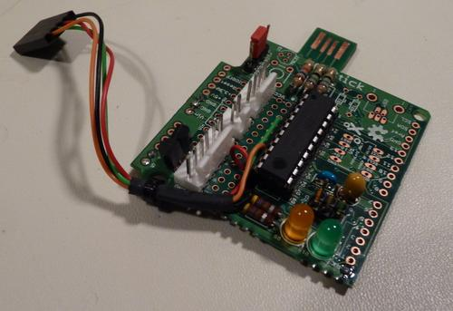
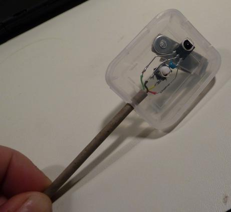

autoblind -- window blind automation, using an XOStick.
=========

background
----------
About 15 years ago I bought some surplus Makita drapery motors
(http://tinyurl.com/bqpafrt, opens in google groups), figured out
how to use them, and then never did anything with them.

In the meantime, I've done a lot of embedded programming,
including on AVR micros.  When OLPC decided to use some extra
circuit board space to create the XO Stick boards
(http://wiki.laptop.org/go/XO_Stick), I wanted to build something
with one of them, and I remembered my motors.  We've lost some
trees around the house lately, so the privacy afforded by the
bedroom window blinds has become more important.  It seemed like
the right time for some automation.

And now, in the morning, I can open the blinds at either end of
the room to see what it's like outside before I ever get out of
bed.

the project
-----------
The complete project gives full up/down control of a single
window blind.  (I've built two, one for each window.)  The blind
can be controlled with a button mounted near the window (mine are
clipped to the curtain), or from a recycled IR remote.  There are
IR commands to raise and lower the blind, and three preset
positions may be configured for one-touch adjustment.  There's
provision for a hard limit switch, so that a runaway motor won't
drag the blind off the window.  There's also a serial console
port with a simple command-line interface, very useful for
development and debugging.

It's all written in C, using avr-gcc.  The processor on the XO
Stick is an ATtiny861.  It does _not_ use any of the USB
capabilities of the XO Stick, for either booting or operation:  I
have a USBTiny programmer that I use for programming, and there's
no real need for USB for this project.  Also, it doesn't use any
of the Arduino libraries -- it's all in raw C.

While my particular application is fairly specific to my needs, I
tried to write the main loop and the IR, button, timer, and
software-driven uart modules in a fairly generic way, for ease of
reuse.

the hardware
------------
The XO Stick is described here http://wiki.laptop.org/go/XO_Stick
and here http://cananian.livejournal.com/66129.html.  While the
XOrduino is way more powerful, it's overkill for most of my home
project needs, it's more expensive, and it's much harder to
solder together.  In addition, the XO Stick has some on-board
prototyping area which is very useful for the inevitable extra
components that come along with any project.

In addition to the XO Stick itself, I needed a limit switch that
could be triggered somehow by something attached to the cord on
the blind, an IR sensor, and an external pushbutton.  I built the
IR sensor and the button into the same little module, small
enough to be clipped to the curtain.  I reused the clip from a
badge holder that I got at some conference or other, and the
"case" for the module is the transparent plastic box that once
held an SD card.

For the limit switch, I initially made my own magnetic sensor
from an old reed switch and some aluminum tubing.

I mounted that parallel to and even with the bottom of the window
sill, and triggered it with a magnet fastened to the blind cord.
that worked, but was harder to mount than I'd like.  I think I'll
explore using a standard burglar-alarm style magnetic sensor
next.

The motors themselves include an odd combination of digital
hardware.  There's some 12V logic that includes closure-to-ground
control for motor on/off and direction control.  There's also a
5V circuit that drives a per-rotation pulse.

More detail of the motor [ here ]( pix/motor_gear_detail.jpg ), [
here ]( pix/motor_pcb1_detail.jpg ), and [ here ](
pix/motor_pcb2_detail.jpg ).

I tapped into that 5V supply for the XO Stick power.  The
per-rotation pulse was useable directly, and I used a couple of
mosfets for the closure to ground inputs to the motor.  I may
have been able to do something simpler, but mosfets are pretty
simple, and I wasn't sure exactly what kind of logic family I was
connecting to.

The business end of the motor is a thing that pops out to mate
with the drapery mechanism when the motor is engaged -- it was a
way of leaving the curtains in "neutral" so that they could be
adjusted by hand when not using the motor.  I didn't use that
facility at all -- happily there's also a hole in the end of the
motor shaft, and I was able to stick in a tight-fitting nail
(with a couple of washers added) to act as a spool.

schematics
----------
The [ XO Stick schematic ]( ./XO-Stick2-sch.pdf ) itself describes
most of the project.

The schematic for the IR receiver can practically be read from
the [ photo ]( pix/ir_receiver_close.jpg ), but here's a rough diagram:

        +---+   Panasonic PNA4602M or Sharp GP1UX511QS IR receiver
        | O |   (looking at the front)
        |   |
         TTT    pin 3 is Vcc
         123    pin 2 is GND
         |||    pin 1 is Vout
         |||
         ||+----+-----------------  Vcc
         ||     |
         ||    ===  .1uf bypass cap
         ||     |
         |+-----+-----------------  ground
         ||
         |+----+PB+---------------  push button
         |
         +------------------------  IR output

The pinouts I chose for the three connectors are:

     LED end                                        cable color
     of board                                       ----------
                   6-pin, to motor
                        GND                         black
                        MOTOR_DIR       PA1         green
                        MOTOR_ON        PA0         blue
                        nc
                        MOTOR_TURN      PA2         brown
                        +5                          red

                    2-pin, to limit switch
                        LIMIT           PA3         yellow
                        GND                         black

                    4-pin, to IR sensor
                        GND                         black
                        BUTTON          PB2         yellow
                        IR              PA4         green
                        +5                          red
      USB end
      of board

That's about it.  Oh -- I did need to add a pull-down to the motor on/off
input (PA0) to keep the motor from turning on while programming
the chip.  That 15K resistor goes from PA0 to ground.

commands
--------
the IR remotes have 5 buttons defined:

    top, middle, bottom, stop, and alt.

these buttons have the following meanings:

    top:     move blind to top position
    middle:  move blind to middle position
    bottom:  move blind to bottom position
    stop:    stop blind movement

    alt top
    alt bottom:  force blind up/down past the top/bottom position

    alt alt top
    alt alt middle
    alt alt bottom:    set the top/middle/bottom position

    alt alt alt stop:  invert the sense of up/down

    alt alt alt alt alt stop:  reset all positions to default

